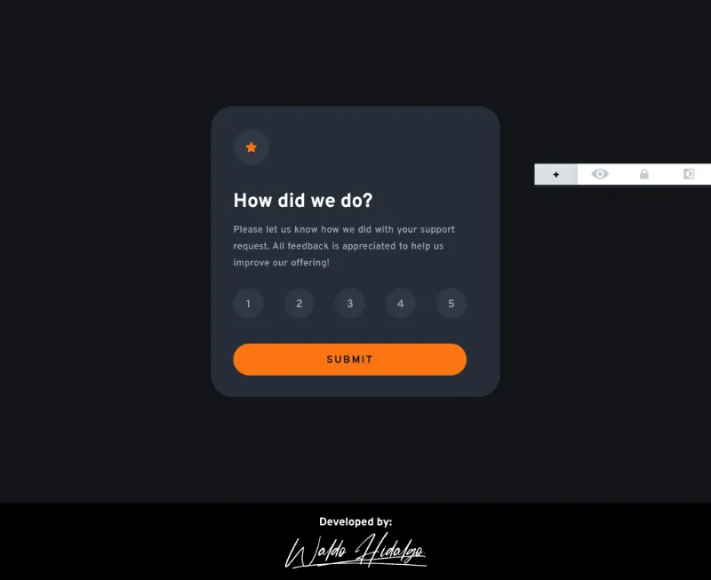
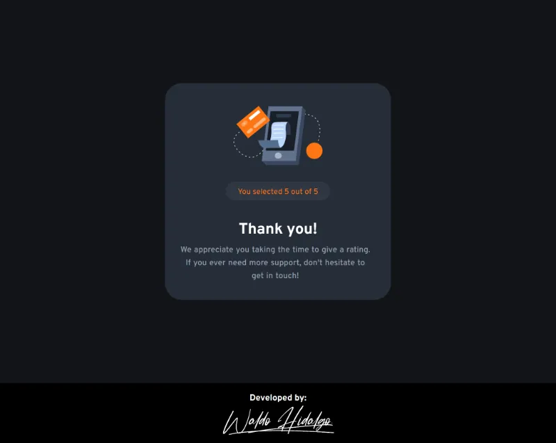
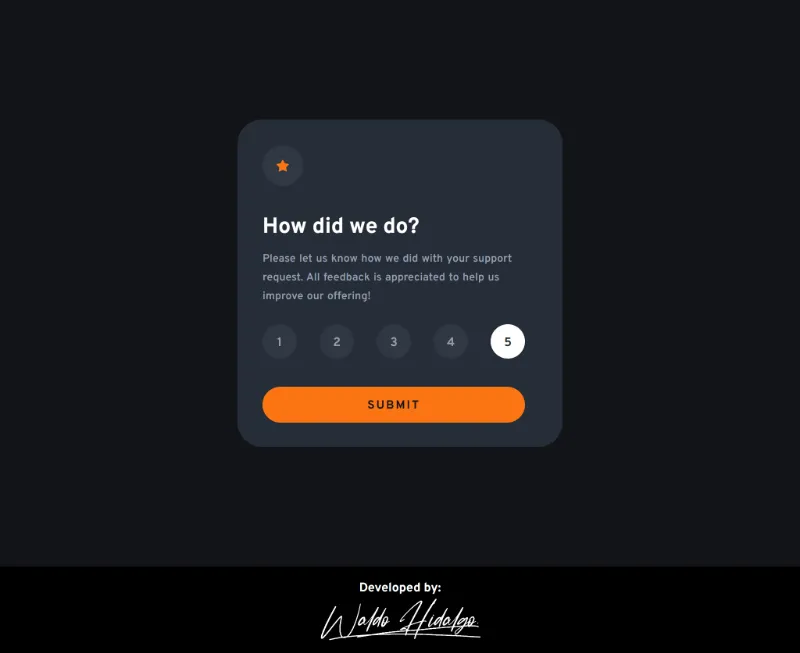

# Interactive rating component

Repositorio con el código solución al challenge: [Interactive rating component challenge on Frontend Mentor](https://www.frontendmentor.io/challenges/interactive-rating-component-koxpeBUmI)

## Tabla de Contenidos

- [Interactive rating component](#interactive-rating-component)
  - [Tabla de Contenidos](#tabla-de-contenidos)
  - [The challenge](#the-challenge)
  - [Diseño a Replicar](#diseño-a-replicar)
    - [1. Mobile Design](#1-mobile-design)
      - [1.1. Mobile Question Design](#11-mobile-question-design)
      - [1.2. Mobile Answer Design](#12-mobile-answer-design)
    - [2.Desktop Design](#2desktop-design)
      - [2.1. Desktop Question Design](#21-desktop-question-design)
      - [2.2. Desktop Answer Design](#22-desktop-answer-design)
    - [3.Active States Design](#3active-states-design)
  - [Proyecto Realizado](#proyecto-realizado)
    - [1. Mobile Sizes](#1-mobile-sizes)
      - [1.1. Mobile Question](#11-mobile-question)
      - [1.2. Mobile Answer](#12-mobile-answer)
    - [2.Desktop Sizes](#2desktop-sizes)
      - [2.1. Desktop Question](#21-desktop-question)
      - [2.2. Desktop Answer](#22-desktop-answer)
    - [3.Active States](#3active-states)

## The challenge

El desafío consiste en realizar lo siguiente:

> Your challenge is to build out this interactive rating component and get it looking as close to the >design as possible.
>
> You can use any tools you like to help you complete the challenge. So if you've got something you'd >like to practice, feel free to give it a go.
>
> Your users should be able to:
>
> - View the optimal layout for the app depending on their device's screen size
> - See hover states for all interactive elements on the page
> - Select and submit a number rating
> - See the "Thank you" card state after submitting a rating

## Diseño a Replicar

### 1. Mobile Design

#### 1.1. Mobile Question Design

#### 1.2. Mobile Answer Design

### 2.Desktop Design

#### 2.1. Desktop Question Design

#### 2.2. Desktop Answer Design

### 3.Active States Design

## Proyecto Realizado

### 1. Mobile Sizes

#### 1.1. Mobile Question

#### 1.2. Mobile Answer

### 2.Desktop Sizes

#### 2.1. Desktop Question

#### 2.2. Desktop Answer

### 3.Active States

